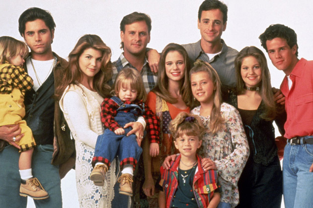
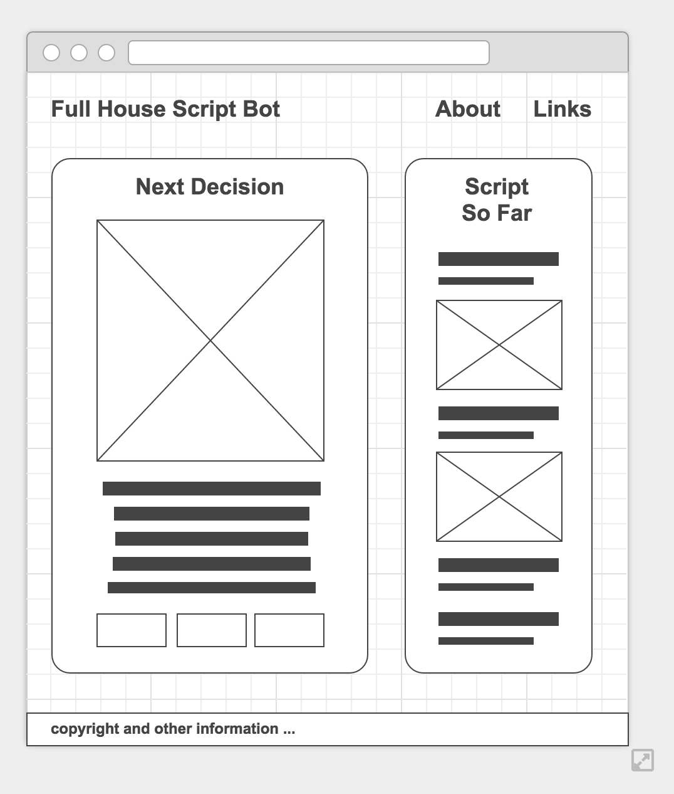

# Full House Script Generator, the Web App!



We're going to make an app that helps you write a script for
[Full House](http://en.wikipedia.org/wiki/Full_House)!

## Setup

Create a new Rails application called `full_house`. There is not any 
deep logic, 
just a series of links to implement, so you do not need to create any 
extra files, 
classes, objects, etc.: just a Rails app!

#### Completion

**This is a bonus assignment!** As always: more is better;
healthy living is best. Only do this if you have completed the Pair Programming Bot.

As an added note: parts 6-10 are very difficult and haven't been fully covered in class. 
Therefore, if you don't understand them, it's ok. Think of the Full House App as
a project you can always come back to for practice - this is not in any way assigned.

#### Flowchart

Here is the flowchart you will use:

<!--  -->


## Part 1 - Planning

Using the above flowchart/decision tree, write out the structure of your app.
Each decision in the process (**the diamonds**) is a page, and any choices will
be links on that page. *This does not mean that every node in the tree is its
own page!* Since there are five decisions and a beginning and end (the rounded
boxes), that means there are **seven** pages or *routes*.

Decide the names for each *route* (or page), and the links that the page will
have.

## Part 2 - Server & Routes

Get your server up and running! Then implement each route, checking to make sure
that the language is correct for each page.

## Part 3 - HTML

Rewrite your routes' output to use correctly formatted HTML. Each page will
either have a series of options represented as links or buttons, and each
option will link to the appropriate page. **Ensure that every page has a header
with a link back to the `index` or starting page at the route `GET /`.

Structure the page correctly with `<div>`, `<a>`, `<span>`, `<p>`, or `<button>`
tags as necessary, adding classes where appropriate (**note:** divs should
almost always have a class).

To simplify your writing, make sure to use a common layout template (ERB)!

## Part 4 - Images

Add images to every page, to illustrate the current story "beat." You can use
any you find on the Internet, but a small group of have been provided locally in
the `img` folder.

## Part 5 - CSS

Make the site readable and usable. Try and theme the style to fit with the
wholesome, family-oriented atmosphere of the presidency of George HW Bush.

Suggestions:

- fonts: Comic Sans, or
  ["handwritting" Google fonts if you're daring](https://www.google.com/fonts)
- colors:
```
"#9900FF" # neon light purple
"#7920FF" # neon purple
"#6600FF" # neon dark purple
"#00FFFF" # neon light blue
"#0000FF" # neon dark blue
"#FF00FF" # neon pink
"#FD0987" # magenta pink
"#FF0000" # neon red
"#FF3300" # neon orange
"#FFFF00" # neon yellow
"#00FF00" # neon green
```
- [tiled backgrounds](https://developer.mozilla.org/en-US/docs/Web/CSS/background-repeat)
  or [borders](https://developer.mozilla.org/en-US/docs/Web/CSS/border-image)
  made with [geometric](https://www.google.com/search?q=80s+geometric+patterns)
  [patterns](https://www.google.com/search?q=90s+geometric+patterns)

#### A Working App

At this point (completion), you should have a working app. If you'd like a guide
for how to build it, here is an example screenshot:

<!--  -->


## Part 6 - Structured Data

Rewrite your app to use a few dynamic route handlers (`/:decision`, eg) and no
more than three ERB templates.

When you do this, hold the data about your site in a data structure internally.
An example would be a hash, like:

```ruby
EPISODE_TREE = {
  :opening => {
    :text => [
      "Opening titles and theme.",
      "Establishing shot of San Francisco Row Houses."
    ],
    :query => "Do we cut to the kids or parents?",
    :options => [
      {:kids    => :cut_to_kids},
      {:parents => :which_parent}
    ]
  },
  :cut_to_kids => ...
}
```

Now make a change to your decision tree! By splitting your view logic and your
data model, you can change the internals of your app on the fly. The preferred
process for this would be to:

- make the change in the flowchart first, so that you can envision the action;
- update the data structure accordingly;
- test it!

## Part 7 - Mocking Persistence

We haven't learned about persisting data with databases yet, but we can still
pretend like our application "*holds state" (has a memory) by encoding our past
in every single request response cycle!

1. Add a query param `story=` to every single link that advances your story.
1. Make the value of the param the entire story so far...
  - this means we have to get the last value of story, and concatenate it to
    what the next part of the story would be for a given choice!
1. Because URLs (and thus query params) can only use certain characters, we have
   to encode and decode our story strings when we use them. You can do this
   using Ruby's standard library `URI`, already included in Rails (check it out in `pry`).
   

Example:

```ruby
@page_content = "Uncle Joey defuses a tense situation with bad humor."

story_so_far = URI.decode(params[:story])
updated_story = story_so_far + "\n" + @page_content

@prompt = "Does everyone laugh?"
@link_yes = "/everyone_laughs?story=" + \
            URI.encode(updated_story + "\n" + "Everyone laughs.")
```

> Once you can get this to work, it may be the perfect situation to refactor the
> logic in to a method to reuse it across your app!

**Finally**, have the final page print out the script you've created!

## Part 8 - Dynamic Visual Content

Use an internal hash to store the image links for the app, like:

```ruby
IMAGES = {
  :opening => "fh-opening-shot.jpg",
  :parents => "fh-parents-smile.jpg"
}
```

Use the above mock persistence to also keep track of the list of images in your
story in a query param `images`. Your query params may now look like:

```
?story=...&images=opening,parents,laughing,credits
```

You can use `split` and `join` in your route handler to make this work!

On the final page, you can use `each` in your view to print out the images
along with the script!

## Part 9 - Visible History

Make the script (so far) and the images visible on every single page, so that
the user can see their script as its being created.

## Part 10 - Holiday Themes

1. Write a special version of the app (special CSS and new info in the data
   structures) to create Holidays-themed episodes!
1. Add a link to a pre-formatted `<pre>` version of the script for printing.
1. Restructure your views according to this wireframe:

<!--  -->

