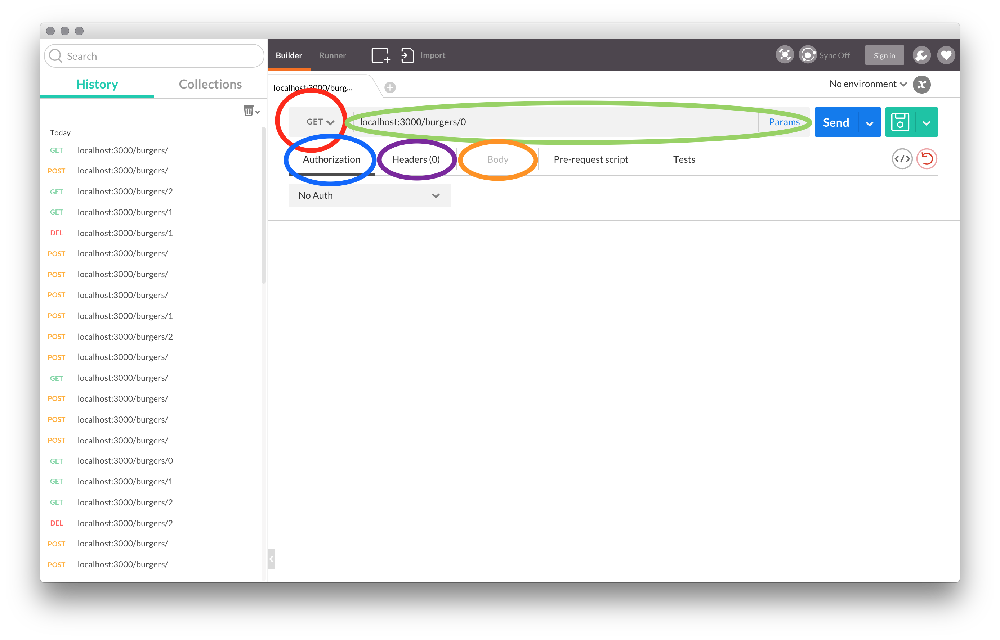

# Cheeseburgers in Cyberspace

## Producing APIs with Node and Express

| Lesson Objectives: SWBAT                 |
| ---------------------------------------- |
| Define a RESTful JSON web service (an "API") |
| Produce a RESTful HTTP JSON web service (an "API”) with Express |
| Use Postman to send data to communicate with a web API |

##### <u>Road Map</u>

1. Serve's Up
2. What is an API?
3. Serving Up Data - GET Requests/Responses
4. Create Data - POST
5. Update Data - PUT
6. Delete Data - DELETE
7. Serve On, Parrothead

## Serve's Up!


Jimmy Buffett didn't stop when he conquered our ears with Margaritaville and Cheesburgers in Paradise. No, he moved on to our stomachs with island escapism themed restaurants. Now, he has his sites [sic] set on our minds by implanting cheesburgers into cyberspace.

Welcome to your first job out of GA - serving burgers in cyberspace.

You'll be doing so by creating a Burgers in Cyberspace API with NodeJS and ExpressJS.

## What's an API?

Before we talk about APIs, __take 2 minutes__ to try and find out on your own

> What did you get?!

I bet you found a bunch of stuff that made little or no sense to you. 
That's because APIs exist throughout computing and there are subtle differences between each kind.

API stands for *Application Program Interface*.

> "An **API** (application program interface) is a set of routines, protocols, and tools for building software applications. The **API** specifies how software components should interact…"
>
> — [Webopedia](http://www.webopedia.com/TERM/A/API.html)

That may seem like a dense definition, but all it needs is a little unpacking. 

**Application Programming Interfaces essentially define how you can use (interact with) any program or object on a computer.** It's the routes to make the technology act.
You've already used many APIs, you just didn't know it. For instance, the `Array` object's API in JavaScript gives us access to methods like `Array.prototype.slice()` or `Array.length`.  

The API we'll be making is a RESTful Web API - it will serve data as JSON about the different hamburgers available at Jimmy Buffett's Cheeseburgers in Cyberspace.

## Serving Up Data - GET

`subl starter_code/` after copying it out of `instructor/`.

We'll be using Postman for the majority of this lesson - let's have a quick review.

#### Postman



**RED** - Set HTTP Verb - POST GET PUT/PATCH DELETE.

**GREEN** - Parameters - set the url for the action

**BLUE** - If any kind of Authorization is necessary, such as OAuth.

**PURPLE** - Set your headers - such as if you want to accept raw JSON.

**ORANGE** - Set the data payload in the body - this is where you can send data to the server.

Postman does a lot more than this, but this is where we'll predominately work during this class.

#### Welcome to Cheeseburgers in Cyberspace

Before we get into routing our own API, go ahead and take **5 minutes** to read over the `starter_code/`.  Focus on `data/`, `config/`, and `controllers/`.

Let's go into `controllers/welcome.js` and see what's happening.

```javascript
var index = function(req, res, next) {
  res.json({msg: "You have found Cheeseburgers in Cyberspace... a new kind of island paradise!"});
};

module.exports = {
  index: index
};
```

We're creating a function called `index()` that loads the response object with JSON and delivers it.

We then export the function for use in other files.

Let's see what's using that function in `config/routes.js`

```javascript
var express = require('express'),
    router  = new express.Router();

// Require controllers.
var welcomeController = require('../controllers/welcome');

// root path:
router.get('/', welcomeController.index);

module.exports = router;
```

You learned about the express router yesterday - here we're setting a GET path for our root address and we're attaching that to the `index` function used in the `welcomeController`. We then export the router object to use in our server.

```javascript
// server.js
// Load local libraries.
var routes   = require('./config/routes');

// ...
// Defines all of our "dynamic" routes.
app.use('/', routes);
```

Everyone should `npm install` and `nodemon` in the terminal and see what happens when we call to our route path.

#### Creating our Own Burger Resource: Index and Show

We will begin by 