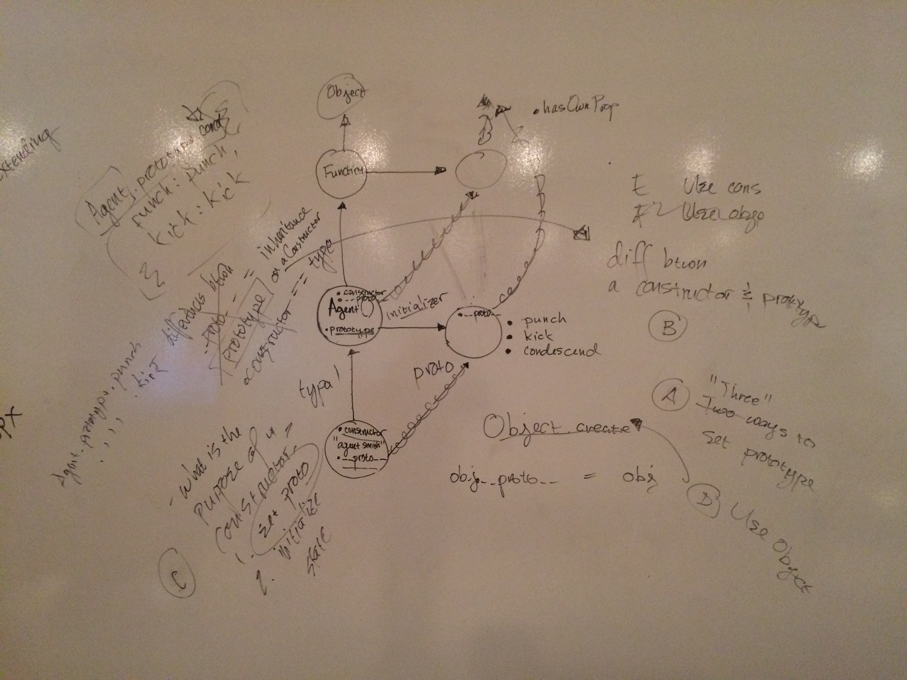

Lesson Objective answers: 

1. Constructor Function, Object.create(), ES2015 Classes
2. constructor references the parent constructor function. prototype is the object on the constructor full of methods shared by all under that prototype.
3. constructor is like a parent class - creates instances of the Object.
4. Object.create() shares the prototype of that object
5. `new` is the constructor pattern

